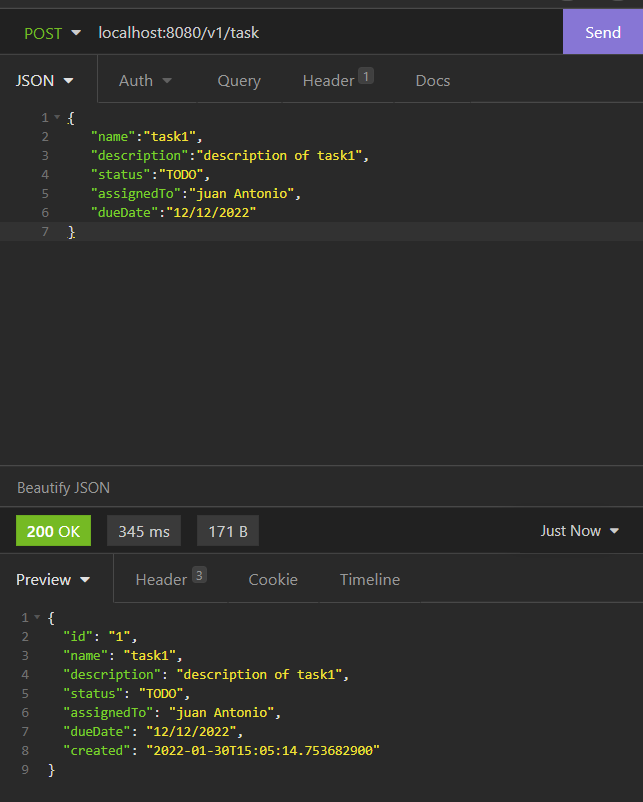
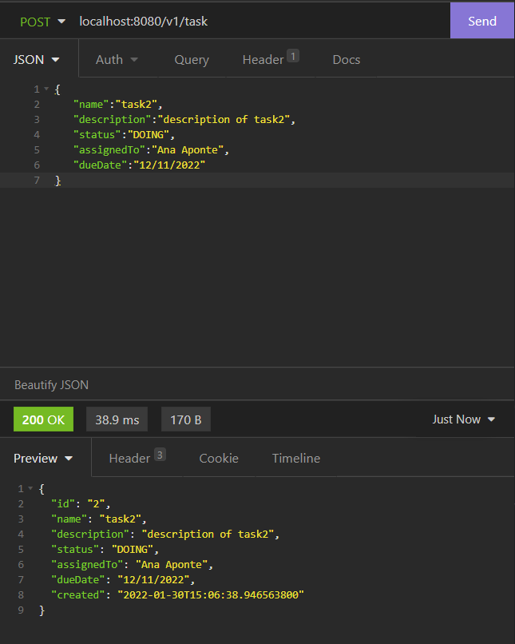
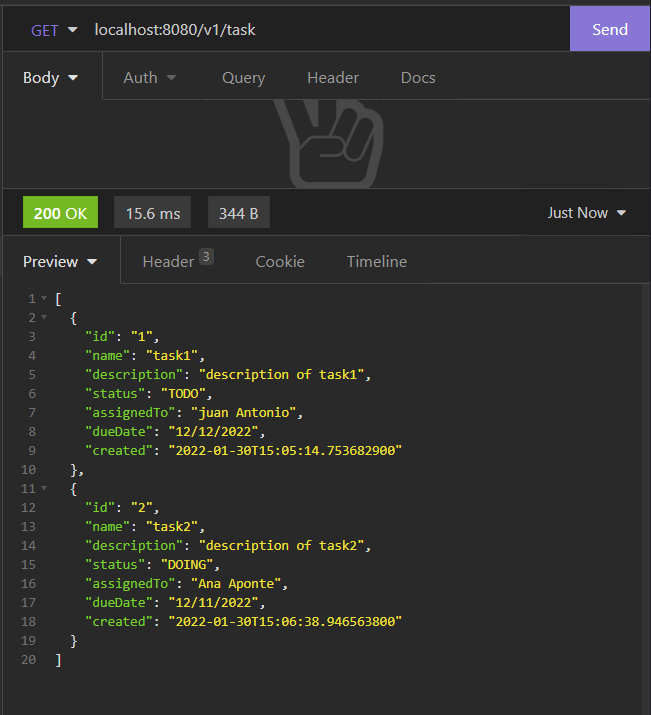
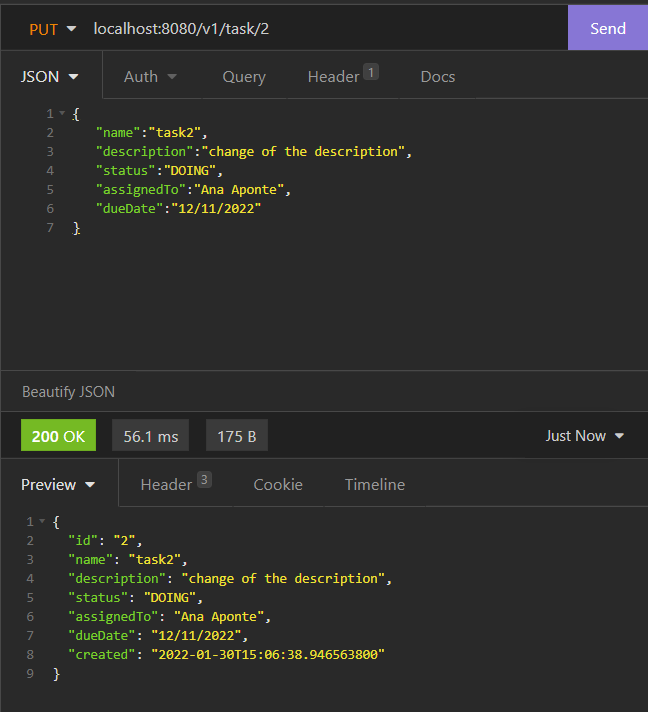
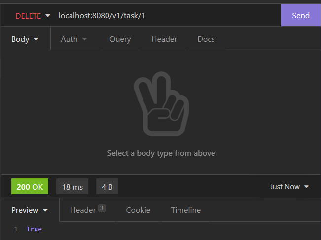
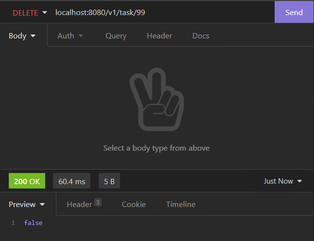
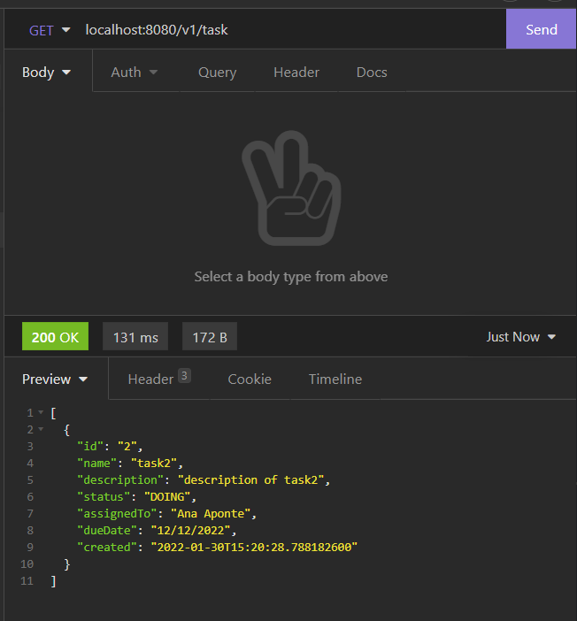

# IETI_LAB_2
## Juan Sebastian Garcia Hincapie
## Implementing the Users Microservice RESTFUL API

## insomnia tests:

### - Post

### - Get

### - Put

### - Delete
valid:

invalid :

verification:
